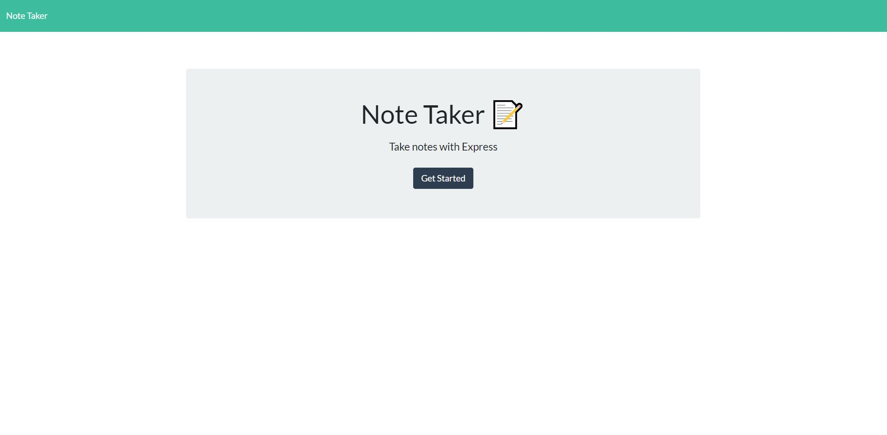

# Note-Taker
   

## Description
This application was created to take quick and fast notes that persist to the next visit. This note taker allows you to add and delete notes.

## Table of Contents
* [Installation](#installation)
* [Usage](#usage)
* [Contributions](#contributions)
* [Questions](#questions)
* [Tests](#tests)

## Installation
If you wish to install this on your own computer then you should first clone the repo. Then install the dependenices and you can then edit and run the server.

## Usage
Clone, Download dependencies and start the server. You can also visit the link below to add your own notes via an online webpage.
[Production Link](https://mighty-cliffs-91530.herokuapp.com/)

## Contributions
Contributions could include the feature of editing notes rather then deleting and creating.

## Questions
Please visit my [GitHub profile](https://github.com/blitman12) for other cool projects
If you have any remaining questions please feel free to reach me at bradlitman94@gmail.com

## Tests
Install jest and run "npm run test" to see them run.
